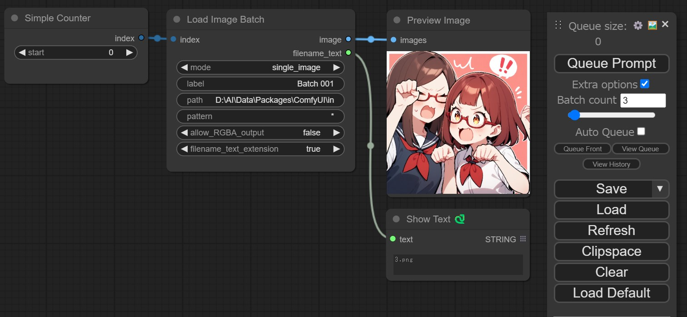

# ComfyUI-SimpleCounter
## 概要
画像の順次読み込みを補助するシンプルなカスタムノードです。 
以下のようにバッチ数を設定して使います。 
 

## 動作
ノードはメニューの「utils」カテゴリーの中にいます。 
バッチ実行中「start」に設定した値からカウントアップしていきます。 
「Queue Prompt」を押すとカウントがリセットされます。 

## ライセンスとか
配布や改変等ご自由にどうぞ。 

Python側はノードの定義のみ、全部JavaScript側で処理してます。 
（バッチ開始を知る術が無かったので……） 